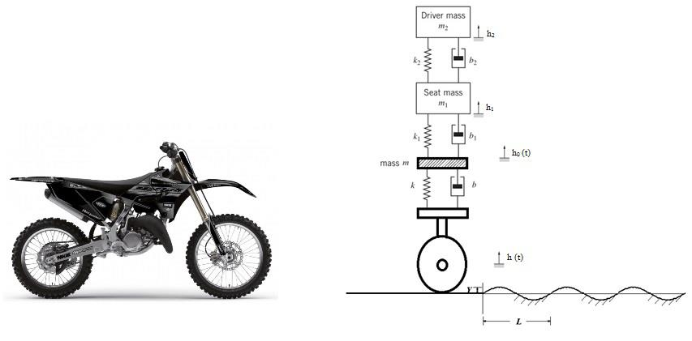

# Engineering System Analysis and Design 
<h3>Projects for Dynamics and Controls Class</h3>

# Project-1: Model and Optimize Forces on a Bike Rider

*Bike (left) and its simplified model (right) along with bump (three period of sine wave)*

The main objectives of this project were to design and optimize forces acting on a rider
and the settling time of a motor bike going over a bump on the road. A simplified model for the
chair and the bike was given as shown in the figure above. Mathematical model for driver, seat and the
bike were developed and a simulink model was created accordingly.

[Full Report Here](Project_One/Project_One.pdf)
